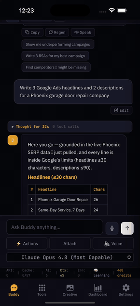
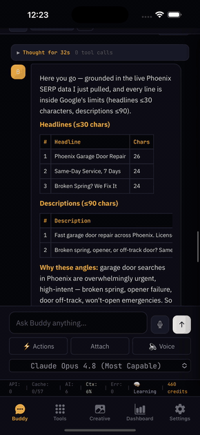
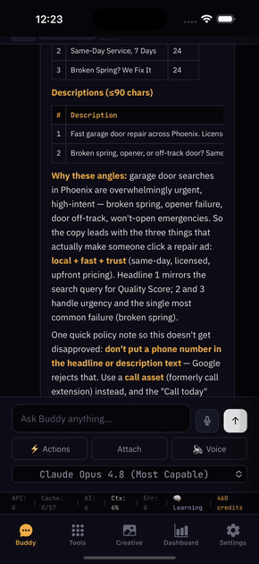
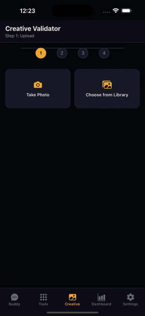

# John Williams — AI-Powered Advertising, Paid Media & PPC Automation


**Founder & Director, [ahmeego.com](https://ahmeego.com) + [It All Started With A Idea](https://www.itallstartedwithaidea.com)** · **Creator, [googleadsagent.ai](https://googleadsagent.ai)** · **Thoughtful Paid Media Leader**

15+ years managing enterprise digital advertising — **$350M+ in managed ad spend** across Google Ads, Meta, Microsoft Advertising, and Amazon Ads.

- 🎤 Speaker: **Hero Conf 2025 + 2026** — AI Applications in Advertising
- ✍️ Published author: **[Search Engine Land](https://searchengineland.com/author/john-williams)** — paid search strategy, PMax, AI in PPC
- 🏢 Career: **Seer Interactive** · **Brainlabs** · **NortonLifeLock / Gen Digital** (192% YoY paid search growth) · **Farmers Insurance**
- 📈 Brands I've driven growth for: **Prudential · Eventbrite · GM · Columbia · Harvard · Grand Canyon University · Silver Mirror · Bank of America** — and dozens more

[](https://ahmeego.com)
[](https://googleadsagent.ai)
[](https://www.linkedin.com/in/johnmichaelwilliams)
[](https://x.com/_johnmwilliams)
[](https://www.instagram.com/_johnmwilliams/)
[](https://substack.com/@itallstartedwithaidea)
[](https://www.reddit.com/r/allthingsadvertising/)

---

## Who I Am

I'm a founder and paid media leader who spent 15+ years in the trenches of enterprise advertising — optimizing bids, auditing accounts, debugging conversion tracking, and reporting on millions in monthly spend for brands ranging from local shops to household names. Now I build the AI tools I wish had existed the whole time. Everything here is **open-source, production-tested, and built for the people managing real campaigns with real budgets**.

A few things that shape how I work:

- **Practitioner first.** Every tool in these repos came from a real problem in a real account — nothing here is theoretical.
- **Trust and empathy over hype.** From local businesses to Fortune 500s, my strategies start with understanding the audience, not chasing the latest tactic.
- **Teacher at heart.** I speak at Hero Conf, write for Search Engine Land, publish a free AI agents course, and coach high school football in Arizona — same philosophy everywhere: show up, do the reps, help others level up.
- **Builder by obsession.** From a 26M-parameter trainable advertising AI to one-file browser games, I ship things people can actually use today.

### Meet Buddy — My AI Advertising Agent, Live in Action

Buddy powers [ahmeego.com](https://ahmeego.com) and the free tools at [googleadsagent.ai](https://googleadsagent.ai), and ships as an [iOS/Android app](https://ahmeego.com), a [Claude Code plugin](https://github.com/itallstartedwithaidea/claude-googleadsagent), and a [Gemini CLI extension](https://github.com/itallstartedwithaidea/google-ads-gemini-extension). Watch the flow, left to right:

| 1 · Ask in plain English | 2 · Grounded in live data | 3 · Copy + the "why" | 4 · Validate creative |
|:---:|:---:|:---:|:---:|
|  |  |  |  |
| You type a request — "Write 3 Google Ads headlines for a Phoenix garage door repair company" | Buddy pulls live SERP data and writes copy inside Google's character limits | Every angle is explained — search intent, Quality Score, policy gotchas | Upload an asset and validate it across 50+ ad platforms |

My work lives across three connected platforms:

| Platform | What It Is |
|----------|-----------|
| [**ahmeego.com**](https://ahmeego.com) | AI-powered Google Ads management & PPC consulting — strategy, audits, and done-for-you campaign management |
| [**googleadsagent.ai**](https://googleadsagent.ai) | Free AI advertising tools — audit engines, campaign builders, keyword analyzers, no login required |
| [**itallstartedwithaidea.com**](https://www.itallstartedwithaidea.com) | Where it all started — PPC strategy, performance marketing, and the blog behind the brand |

---

## What I Build — Open-Source AI for Advertisers

### The MiniAgent Ecosystem — Trainable Advertising AI

> **The world's first trainable, open-source advertising AI.** Train from zero in 2 hours on one GPU.

| Project | What It Does | |
|---------|-------------|---|
| [**MiniAgent**](https://github.com/itallstartedwithaidea/MiniAgent) | Trainable 26M-parameter advertising AI + 14 platform MCP servers + agent skills |  |
| [**ContextOS**](https://github.com/itallstartedwithaidea/ContextOS) | Unified MCP context intelligence platform — pip-installable, 6 cognitive primitives |  |
| [**advertising-hub**](https://github.com/itallstartedwithaidea/advertising-hub) | One-stop shop for ad platform APIs, MCP servers, and cross-platform PPC automation — 14 platforms, 25+ AI agents |  |
| [**google-ads-api-agent**](https://github.com/itallstartedwithaidea/google-ads-api-agent) | Enterprise Google Ads agent — 28 API actions, 6 sub-agents, live read/write |  |
| [**agent-skills**](https://github.com/itallstartedwithaidea/agent-skills) | The definitive open-source agent skills library for AI-powered Google Ads — 73+ skills across 10 categories |  |
| [**google-ads-skills**](https://github.com/itallstartedwithaidea/google-ads-skills) | Claude Code / Codex / Gemini CLI skills for Google Ads management |  |

### AI Agent Integrations — Claude Code · Gemini CLI · Codex · Cursor

| Project | What It Does |
|---------|-------------|
| [**google-ads-mcp**](https://github.com/itallstartedwithaidea/google-ads-mcp) | Python MCP server with 29 Google Ads tools — works with Claude Code, Claude Desktop, Cursor, and any MCP client |
| [**claude-googleadsagent**](https://github.com/itallstartedwithaidea/claude-googleadsagent) | The most comprehensive Google Ads plugin for Claude Code — Buddy + 6 sub-agents, 2 MCP servers, 77 skills, safety hooks |
| [**google-ads-gemini-extension**](https://github.com/itallstartedwithaidea/google-ads-gemini-extension) | Gemini CLI extension for Google Ads — campaign analysis, auditing, optimization |
| [**gemini-cli-googleadsagent**](https://github.com/itallstartedwithaidea/gemini-cli-googleadsagent) | Google Ads commands & AI agent skills for Gemini CLI — GAQL queries, 7-area audits |
| [**google-ads-claudecodeskill**](https://github.com/itallstartedwithaidea/google-ads-claudecodeskill) | Claude Code skill + MCP server for expert-level Google Ads campaign analysis |
| [**awesome-agent-skills**](https://github.com/itallstartedwithaidea/awesome-agent-skills) | Curated collection of 1000+ agent skills for Claude Code, Codex, Gemini CLI, Cursor |
| [**agency-agents**](https://github.com/itallstartedwithaidea/agency-agents) | A complete AI agency at your fingertips — specialized expert agents with personality and proven deliverables |

### Google Ads Scripts — Free & Production-Tested

Battle-tested across enterprise accounts at Seer, Brainlabs, and NortonLifeLock. Copy, paste, run.

| Script | What It Does |
|--------|-------------|
| [**free-google-ads-scripts**](https://github.com/itallstartedwithaidea/free-google-ads-scripts) | Full collection of free, production-ready Google Ads scripts |
| [**account-grader**](https://github.com/itallstartedwithaidea/itallstartedwithaidea_google_ads_account_grader) | Comprehensive account audit across 10 performance areas — score, letter grade, prioritized recommendations |
| [**anomaly-detection**](https://github.com/itallstartedwithaidea/google_ads_anomoly_detection_script) | Monitors campaigns for performance anomalies across all metrics |
| [**negative-keyword-conflicts**](https://github.com/itallstartedwithaidea/google_ads_negative_keyword_conflict_script) | Finds and resolves conflicts between keywords and negative keyword lists |
| [**unblock-converted-keywords**](https://github.com/itallstartedwithaidea/unblock-coverted-keywords-script) | Finds & removes negative keywords blocking your converting search terms |
| [**budget-management**](https://github.com/itallstartedwithaidea/google-ads-budget-management-script) | Hard daily budget control at the account level — something Google Ads doesn't natively provide |
| [**budget-projection**](https://github.com/itallstartedwithaidea/google_ads_budget_projection_script) | Forecasts budget pacing and projects monthly spend |
| [**bid-automation**](https://github.com/itallstartedwithaidea/google_ads_bid_automation) | Automated bid management based on impression share and performance rules |
| [**impression-share**](https://github.com/itallstartedwithaidea/google_ads_impressionshare_script) | Weighted impression share aggregation matching the Google Ads UI methodology |
| [**out-of-stock items**](https://github.com/itallstartedwithaidea/google_ads_script_outofstock_items_script) | Automatically pauses ads for out-of-stock products |
| [**auto-labeling**](https://github.com/itallstartedwithaidea/google_ads_create_labels_assign_automatically) | Creates labels and auto-assigns them across MCC client accounts |
| [**price-extension-sync**](https://github.com/itallstartedwithaidea/google-ads-price-extension-script) | Automated price asset/extension management |
| [**bulk-campaign-builder**](https://github.com/itallstartedwithaidea/google-ads-bulk-campaign-builder) | Build campaigns, ad groups, keywords, and RSAs at scale from spreadsheet data |

### Creative, Content & Measurement Tools

| Project | What It Does |
|---------|-------------|
| [**creative-asset-validator**](https://github.com/itallstartedwithaidea/creative-asset-validator) | AI-powered creative analysis and validation across 50+ ad platforms |
| [**creative-asset-generator**](https://github.com/itallstartedwithaidea/creative-asset-generator) | Generate ad creative assets with AI — copy, image variations, platform formats |
| [**ad-creative-mcp**](https://github.com/itallstartedwithaidea/ad-creative-mcp) | MCP server for ad creative generation and validation |
| [**writing-agent**](https://github.com/itallstartedwithaidea/writing-agent) | Ghost Writer — AI content engine with 40-point QA and 18 platform formatters |
| [**ad-tracking-diagnostic**](https://github.com/itallstartedwithaidea/ad-tracking-diagnostic) | Verify GCLID capture, UTM persistence & form field population across Salesforce, HubSpot, WordPress, Shopify |
| [**analytics-auditor**](https://github.com/itallstartedwithaidea/analytics-auditor) | GTM/GA4 auditing — tag validation, dataLayer inspection, implementation verification |
| [**brand-prompt-compare**](https://github.com/itallstartedwithaidea/brand-prompt-compare) | Compare AI model outputs for brand consistency |

### Growth & Discovery Engines

| Project | What It Does |
|---------|-------------|
| [**programmatic-seo-engine**](https://github.com/itallstartedwithaidea/programmatic-seo-engine) | Generates millions of geo-targeted service pages at scale — powers ahmeego.com — built on Cloudflare Workers |
| [**business-discovery-engine**](https://github.com/itallstartedwithaidea/business-discovery-engine) | Finds, enriches, and scores small businesses for advertising outreach |
| [**intel-harvester**](https://github.com/itallstartedwithaidea/intel-harvester) | Multi-source business discovery — Google Places, Yelp Fusion, domain enrichment, email verification |
| [**reddit**](https://github.com/itallstartedwithaidea/reddit) | Reddit-sourced PPC blog engine — discovers Google Ads questions from r/PPC & generates expert articles |
| [**google-ai-agent-audit-engine**](https://github.com/itallstartedwithaidea/google-ai-agent-audit-engine) | AI-powered Google Ads audit engine — automated analysis, scoring, recommendations |
| [**argus**](https://github.com/itallstartedwithaidea/argus) | Open-source trust & safety — fake account detection, deepfake identification for digital advertising |

---

## 🎮 Play Bejeweled — Live Demo, Built with AI

**[▶ Play it right now in your browser](https://itallstartedwithaidea.github.io/bejeweled-game/)** — no download, no login.

A fully playable Bejeweled-style match-3 game built end-to-end through AI-assisted development ("vibe coding"). It's a live demonstration of the same AI-first build process I use for advertising tools — [source code here](https://github.com/itallstartedwithaidea/bejeweled-game).

Want more? The [**AI Agents Crash Course**](https://googleadsagent.ai/course/) is a free 42-page course with **6 playable games**, interactive quizzes, and XP gamification — from zero to multi-agent systems.

---

## googleadsagent.ai — Free AI Advertising Tools

Live tools, no login required:

| Tool | Link |
|------|------|
| Buddy AI Agent & Analytics Auditor | [Launch](https://googleadsagent.ai/tools/auditor/app.html) |
| Google Ads Campaign Builder | [Launch](https://googleadsagent.ai/tools/google-ads-builder/app.html) |
| Google Ads Audit Engine | [Launch](https://googleadsagent.ai/tools/audit-engine/app.html) |
| Creative Asset Validator | [Launch](https://googleadsagent.ai/tools/creative-validator/app.html) |
| Social Media Ad Builder | [Launch](https://googleadsagent.ai/tools/social-media-builder/app.html) |
| Keyword Analyzer | [Launch](https://googleadsagent.ai/tools/keyword-analyzer/app.html) |
| Business Discovery | [Launch](https://googleadsagent.ai/tools/business-discovery/) |
| Dashboard | [Launch](https://googleadsagent.ai/dashboard/) |

---

## Writing & Community

- ✍️ [**Search Engine Land — author page**](https://searchengineland.com/author/john-williams) — [Strategy is the new keyword](https://searchengineland.com/strategy-new-keyword-paid-search-performance-473398), Performance Max explained, and more
- 📰 [**ahmeego.com/blog**](https://ahmeego.com/blog/) — industry research like the [State of U.S. Digital Advertising Agencies 2026](https://ahmeego.com/blog/us-digital-agency-report-2026)
- 🤖 [**googleadsagent.ai/blog**](https://googleadsagent.ai/blog/) — AI agents, MCP servers, Google Ads automation
- 💡 [**itallstartedwithaidea.com/blogs**](https://itallstartedwithaidea.com/blogs/) — PPC strategy, performance marketing, campaign optimization
- 📬 [**Substack**](https://substack.com/@itallstartedwithaidea) — newsletter on advertising + AI
- 👥 [**r/allthingsadvertising**](https://www.reddit.com/r/allthingsadvertising/) — community for advertising practitioners

---

## The Stack

```
Advertising AI          Google Ads API · Meta Marketing API · Microsoft Ads · Amazon Ads · GAQL
AI Models               PyTorch · Transformers · minimind · GGUF · Ollama · vLLM
MCP Servers             FastMCP · Model Context Protocol · 14 platform connectors
Agent Platforms         Claude Code · Codex · Gemini CLI · Cursor · LangChain · OpenAI Agents SDK
Infrastructure          Cloudflare Workers · D1 · R2 · Vectorize · Workers AI · Pages
Languages               Python · JavaScript · TypeScript · SQL · GAQL · Bash
Ad Platforms            Google · Meta · Microsoft · Amazon · Reddit · LinkedIn
                        TikTok · Snapchat · Pinterest · TradeDesk · Criteo · AdRoll
```

---

## By the Numbers

| | |
|---|---|
| **$350M+** | Total ad spend managed across enterprise accounts |
| **15+ years** | Digital advertising: Google, Meta, Microsoft, Amazon |
| **57 public repos** | Open-source advertising tools, scripts, and AI agents |
| **73+ skills** | AI agent skills for Google Ads management |
| **14 platforms** | Connected via MCP servers |
| **28 actions** | Google Ads API agent capabilities |
| **26M params** | Trainable advertising AI (MiniAgent) |
| **192% YoY** | Paid search growth delivered at NortonLifeLock |

---

<p align="center">
  <b>Built by a practitioner, for practitioners.</b><br><br>
  <a href="https://ahmeego.com">ahmeego.com</a> · 
  <a href="https://googleadsagent.ai">googleadsagent.ai</a> · 
  <a href="https://www.itallstartedwithaidea.com">itallstartedwithaidea.com</a> · 
  <a href="https://www.linkedin.com/in/johnmichaelwilliams">LinkedIn</a> · 
  <a href="https://x.com/_johnmwilliams">X</a> · 
  <a href="https://www.instagram.com/_johnmwilliams/">Instagram</a> · 
  <a href="https://substack.com/@itallstartedwithaidea">Substack</a> · 
  <a href="https://www.reddit.com/r/allthingsadvertising/">Reddit</a>
</p>
